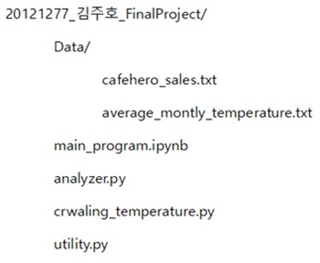
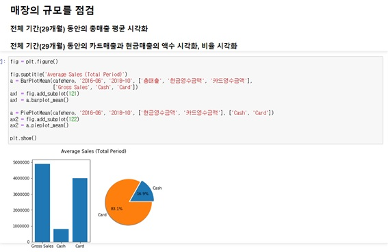
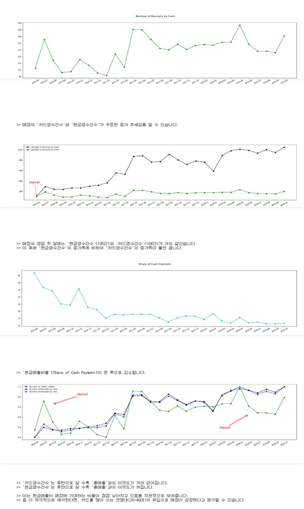
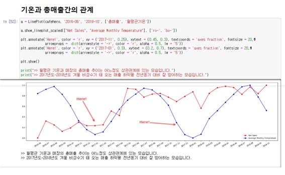

# Fundamental big data programming  course in 2020-1 semester

## Python Data Analysis lecture

- Learn an OOP programming
- Learn a Regular Expression
- Learn a matplotlib, numpy, pandas Python library
- Exception Handling, FileIO etc..

## Final term Project

### Description

- Data such as `monthly sales`, `number of customers`, and `number of cancellations` for 29 months of a certain store (store name: Cafe Hero) recorded in the cafehero_sales.txt file are imported and analyzed. 
- Meaningful proposals are made based on this data. 
- The source of the above data is a cafe managed by the student oneself, and the Excel data provided by the POS company was transferred to a text file.
- **Crawl** the monthly average temperature information from the homepage of the Korea Meteorological Administration.
- **Visualize several data** in various ways by Python library package.

### Directory Structure

### Files

- `utilty.py` : a module that imports text file data to editor
- `crawling_temperature.py`: Crawling the monthly average temperature information from the homepage of the Korea Meteorological Administration and saves this data as a local text file.
-  `analyzer.py` : A script that collects useful user-defined classes and methods for data visualization. This will reduce code repetition and enable data visualization for desired purposes with much simpler coding.
-  `main_program.ipynb` : Main program that plots and shows data and processes variously. By looking at the visualized data, you will be able to judge whether there are any significant phenomena or ideas.

### Analyze and Visualize

