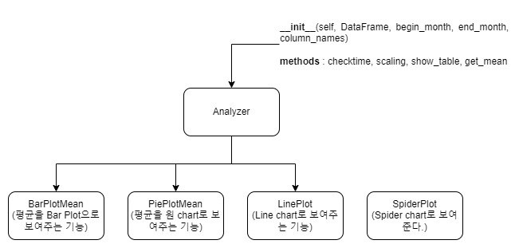
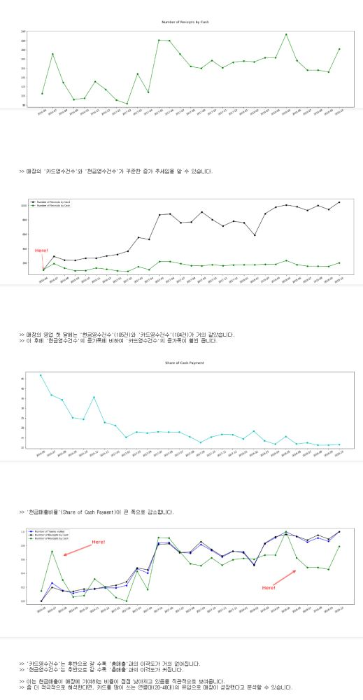

# Fundamental big data programming  course in 2020-1 semester

## Python Data Analysis lecture

- Learn an OOP programming
- Learn a Regular Expression
- Learn a matplotlib, numpy, pandas Python library
- Exception Handling, FileIO etc..


## Final term Project (직접 운영한 매장 매출 기록으로 데이터분석)

### Description

- Data such as `monthly sales`, `number of customers`, and `number of cancellations` for 29 months of a certain store (store name: Cafe Hero) recorded in the cafehero_sales.txt file are imported and analyzed. 
- Meaningful proposals are made based on this data. 
- The source of the above data is a cafe managed by the student oneself, and the Excel data provided by the POS company was transferred to a text file.
- **Crawl** the monthly average temperature information from the homepage of the Korea Meteorological Administration.
- **Visualize several data** in various ways by Python library package.


### Directory Structure


### Files

- `utilty.py` : a module that imports text file data to editor
- `crawling_temperature.py`: Crawling the monthly average temperature information from the homepage of the Korea Meteorological Administration and saves this data as a local text file.
- `analyzer.py` : A script that collects useful user-defined classes and methods for data visualization. This will reduce code repetition and enable data visualization for desired purposes with much simpler coding.
- `main_program.ipynb` : Main program that plots and shows data and processes variously. By looking at the visualized data, you will be able to judge whether there are any significant phenomena or ideas.


### 1. 목표 설정 및 구현 방법

- 목표 설정

  - 텍스트 파일의 형태로 존재하는 한 매장(카페히어로)의 매출 기록을 프로그램으로 가져온다.
  - 이를 분석하여 의미있는 현상을 캐치하고, 매장이 발전적으로 나아갈 수 있는 제안을 한다.

- 방법

  - 매장의 매출 기록이 적힌 text 파일을 가져와서 이를 다양하게 시각화
  - 이를 위해 필요한 모듈들을 기능에 따라 다음과 같이 생성하였다.
    - `utilty.py` : text 파일의 데이터를 편집기로 가져오는 모듈
    - `crawling_temperature.py` : 기상청 홈페이지에서 월 평균 기온 정보를 crawling하여 이 data를 로컬의 text파일로 저장한다.
    - `analyzer.py` : 데이터 시각화를 위해 유용한 사용자 정의 class 및 method를 모아놓은 스크립트이다. 이는 코드의 반복사용을 줄여주고, 훨씬 간단한 코딩으로 원하는 목적의 데이터 시각화를 가능하게 할 것이다.
    - `main_program.ipynb` : 데이터를 plot하여 보여주고, 다양하게 가공하는 메인 프로그램이다. 시각화된 데이터를 보고 유의미한 현상이나 생각거리는 없는지 판단하게 될 것이다.

- 디렉토리 구조

  ```
  20121277_김주호_Final_Project/
  	Data/
  		cafehero_sales.txt
  		averages_monthly_temperature.txt
      main_program.ipynb
      analyzer.py
      crawling_temperature.py
      utility.py
  ```

  ​

### 2. 코드 작성

#### utility

- `def build_DataFrame_from_text(path)`

        

  - path에 있는 데이터를 가져와 DataFrame을 생성하여 돌려주는 함수를 정의
  - 해당 파일을 읽어오는 것을 실패했을 경우에 대한 예외처리를 해준다. 파일 읽기에 실패하였다는 메시지를 출력해준다.
  - 원본 데이터는 숫자가 1,000,000처럼 쉼표가 있어, 이 ‘문자열’을 사용해 연산하기는 쉽지 않다. 
  - 1,000,000 -> 1000000 으로 쉼표를 제거하는 작업이 필요하다. 
  - 여기서 정규표현식의 sub 모듈을 사용하였다. (`re.sub`)

- `def add_TextData_to_DataFrame(path, DataFrame, column_name)`

    

  - text 파일에 있는 데이터(temperature가 기록된 text 파일)를 가져와서, 이를 DataFrame의 column으로 설정하는 함수이다. 
  - 두 함수 모두 path를 인자로 받을 수 있도록 하였다. 
  - 이는 함수의 재사용성을 고려한 것이다.

#### crawling_temperature.py


- 파일을 쓰기모드로 가져오는 데에 실패한다면, 오류메세지를 출력해주는 예외처리를 하였다.
- 매장의 매출 기록은 2016년도부터 2018년도까지의 기록이므로, 이 시기의 날씨를 기상청 홈페이지에서 크롤링하고자 한다.
- 코드의 세세한 동작은 주석으로 설명하였다. 
- 이 스크립트에서도 원하는 data에 접근하기 위해 정규표현식의 개념을 활용하였다.
- 크롤링에 시간이 꽤나 소요된다. 
- 정확히 얼마나 걸리는 지 알아보기 위해 크롤링 시작 전에 `time.time()`을 찍어두고, 크롤링이 완료되면 `time.time()`를 찍어 이 차이를 본다. 
  - 대략 평균 8초 정도 소요된다.
- **출력 결과**

​      


#### analyzer.py

- `analyzer.py` 스크립트에는 여러 가지 class와 그 class가 가지고 있는 method들이 있는데, 전체적인 골격은 다음과 같다.

  

  - SpiderPlot은 1년 단위의 분포를 시각화하기 위한 기능을 수행하는 class여서, `begin_month`와 `end_month`를 인자로 받을 필요가 없다. 
  - 따라서 `Analyzer`의 상속을 받지 않았다.

- `class Analyzer`

    

- instance variables

  - `self._DataFrame`, `self._column_names`
    - 처음 생성자로 설정되는 인스턴스 변수들이 이렇게 둘인 것은, 입력으로 받은  DataFrame에서 특정 column을 골라서 만든 새로운 DataFrame이 객체의 정보가 된다는 것을 말한다.

- 메쏘드1： `checktime(func)`

  - class의 함수에 decorated 되어 실행시간을 측정한다.

- 메쏘드2 : `scaling(cls, Series)`

  - 여러 개의 그래프를 한 figure에 그리게 될 때, y value가 움직이는 범위가 서로 판이하게 달라 그 상관관계를 파악하기 어려울 때가 있다. 
  - 이 때, y의 범위를 모두 0과 1로 scaling하고 그리게 되면, 두 지표의 상관관계를 파악하기 용이하게 된다. 

- 메쏘드3 : `show_table(self)`

  - 객체가 가지고 있는 정보를 table의 형태로 보여준다.

- 메쏘드4 : `get_mean(self)`

  - self 객체의 column들의 평균을 구해 리스트로 돌려준다. 
  - 그 평균들은 `self._mean_list`로 가지고 있다. column이 ‘현금매출비율’ 이거나 ‘평균기온’이면, 소숫점 아래 첫 번째 자리까지 나타낸다.

- `class BarPlotMean(Analyzer)`

    

  - 객체의 column들의 평균을 bar 그래프로 보여줄 수 있다. 
  - label을 같이 인자로 넣어주면, `self._labels`에 리스트형태로 label 정보를 가지고 있는다. 
  - `plt.bar`를 return

- `class PiePlotMean(Analyzer)`

    

  - 객체의 column들의 평균을 Pie 그래프로 보여줄 수 있다. 
  - label을 같이 인자로 넣어주면, `self._labels`에 리스트형태로 label 정보를 가지고 있는다. 
  - `plt.pie`를 return

- `class LinePlot(Analyzer)`

    

- 메쏘드1: `show_one_lineplot(self, title, linestyle)`

  - title과 linestyle (이를테면 ‘bo-’)를 같이 인자로 주게 되면, title을 붙여서 linestyle에 맞게 하나의 column을 plot해주게 된다. 

- 메쏘드2: `show_several_lineplot(self, labels, linestyles)`

  - 여러 개의 그래프를 한 figure에 동시에 그려주는 메쏘드. 지표 여러개의 상관관계를 파악할 때 유용하다.

- 메쏘드3: `show_lineplot_scaled(self, labels, linestyles)`

  - 여러 개의 지표의 상관관계를 파악하기 용이하다. 
  - 여러 column들을 0과 1로 scaling하여 보여준다.

- `SpiderPlot()`

    

    

  - 해당 년도의 column자료를 `Spider chart(Radar chart)`로 보여준다. 
  - 이 포맷은 1년이 아니라면 그 의미가 덜하여서, `begin_month`와 `end_month`를 인자로 받는 `Analyzer` 클래스에서 상속받지 않았다. 
  - spider chart는 polar chart를 기반으로 그리는 것인데 디폴트가 반시계방향이며, 0도의 위치부터 그리기 때문에 원하는 바대로 그려주기 위해서는 이를 사전에 조정해주어야 한다. 
  - 그 작업은 주석으로 달아놓았다.

### 코드 수행 결과 (main_program에서의 실행 모습)

    

    

  

​      

    

  

    

    

    

    


### 느낀점

- 그래프를 두고 **적극적인 해석**을 시도할 수 있다.
  - 예시1) '총매출'이 증가하는데 '객단가'(1팀이 매장에서 소비하는 액수)가 확연히 줄어든다면, 이는 1~2인 규모의 팀의 유입이 증가했다고 해석
  - 예시2) '현금영수건수'와 '총매출'의 이격도가 커진다면, 이는 '카드매출'의 비율이 증가한다는 것이고, 더 적극적으로 카드를 주로 소비하는 연령층(20~40대)이 많이 유입되었다고도 해석
- 그래프를 두고 해석을 시도할 때는 **논리적인 비약 혹은 통계의 오류를 경계**해야 한다.
- **적극적인 해석을 시도할 수록 더 많은 추가 검증**으로 근거를 뒷받침해야한다고 느꼈다.
- 데이터가 유의미한 변화와 추이를 보여준다는 것은 행운이다.
  - 운이 좋게도 데이터가 유의미한 변화를 보여주었으나, 데이터 분석의 결과가 ‘별 의미를 찾을 수 없음’이 된다면, 힘 빠지는 일이 될 것이다.
- 데이터를 정돈하는 일 또한 중요한 테스크이다. 
  - POS 업체에서 넘겨준 잘 정돈된 기록이 있었기에 수월하게 과제를 수행할 수 있었다. (프로젝트의 시작을 정돈된 txt 파일로부터 착수할 수 있었다.) 
  - 생활 속의 조악한 데이터를 관찰 대상으로 하였다면, 데이터를 정돈하는 것부터 힘든 과정이었을 것이며, 이는 또 다른 영역의 task였을 것이다.