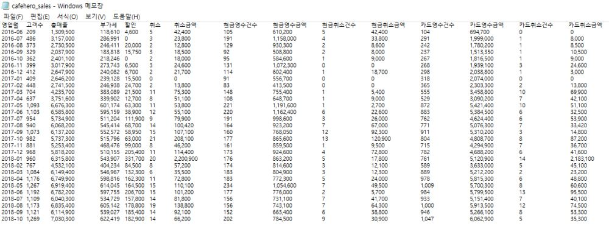

# 목표 설정 및 문제 정의

- `cafehero_sales.txt`



  >위 자료의 출처는 수강생 본인이 직접 운영했던 카페로 POS 업체가 제공한 엑셀 자료를 메모장에 옮긴 것이다.


- **전체 목표**
  - `cafehero_sales.txt` 파일에 기록된 어떤 매장(매장명: 카페히어로)의 29개월간의 월별 매출과 고객 수, 취소 건수 등의 데이터를 가져와 **분석하고 시각화**
  - 위를 근거로 이 매장에 **유의미한 제안** 


- **세부 목표**
  - begin_month와 end_month를 입력하면, 입력한 기간 내의 데이터를 시각화하여 보여준다.
  - 현재 텍스트 파일에 있는 지표들을 이용해 유의미한 새로운 지표들을 생성한다.
    - ex) ‘순매출’을 ‘방문 팀 수’로 나눈 “객단가”라는 지표를 만든다.
  - 이 매장이 어느 정도 규모의 매장인지를 여러 지표들을 시각화하여 알려줄 수 있다.
    - ex) 전체기간동안 순매출 평균, 가장 최근 달의 순매출을 보여준다.
  - 카드 매출과 현금 매출의 비율을 보여준다.
  - 여러 가지 지표들(새롭게 생성한 지표들 포함)의 시간에 따른 추이를 다양하게 시각화하여 보여준다. 
  - ‘`기온이 높은 달일수록 사람들이 음료를 많이 찾게 되어, 카페의 매출이 증가할 것이다.`’는 추정을 해보고, 이를 검증하고자, 해당 년도의 월별 온도를 crawling하여 그 추이를 시각화한다. 
    - 그리고 위 지표들과의 상관관계를 살핀다.
  - 크롤링에 걸리는 시간 혹은 시각화 프로그램이 동작할 때 걸리는 실행시간을 checktime 메쏘드를 이용해 측정해본다.

# 해결 방향

- 아래와 같은 디렉토리 구조를 만든다.

```
20121277_김주호_Final_Project/
	Data/
		cafehero_sales.txt
		averages_monthly_temperature.txt
    main_program.ipynb
    analyzer.py
    crawling_temperature.py
    utility.py
```


- 위 디렉토리에 저장된 Data와 class들은 이를테면, 아래와 같이 사용 가능하다.

```python
# Maib_Program.ipynb에서
import analyzer
analyzer_instance = analyzer.Analyzer(begin_month='2017-03', end_month='2017-05')
analyzer_instance.piplot()
```


- 텍스트파일에서 데이터를 가져올 때, 예외처리
  - 파일을 읽어 오는 데에 오류가 생길 시에 오류가 발생하였음을 알린다.
- 데이터를 가져와서 만드는 새로운 데이터 및 지표들은 다음과 같다. (이는 일부 더 추가될 수 있음)
  - $순매출 = 총매출 - 할인금액$
  - $객단가 = \frac {순매출} {방문팀 수}$
  - $현금매출 비율 = \frac {현금매출} {현금매출 + 카드매출} *100 (\%)$
- 전체 기간 동안의 매출 평균, 가장 최근 달의 매출을 시각화(막대그래프, 원그래프)하여 매장의 규모를 보여준다.
- 시간에 따른 추이를 보여줄 때는, 선 그래프로 보여준다.
- 경우에 따라, **여러 개의 그래프를 한 플롯에 겹쳐 그려서**, 비교를 선명히 하도록 한다.
- 경우에 따라, **서로 다른 2개의 그래프도 y축을 달리하여(하나는 left, 하나는 right) 그 비교**가 가능하도록 만든다.
- 서로 다른 지표가 그 연관성이 있는지를 살피기 위해, 한 플롯에 동시에 그릴 수 있다. 이 때, 두 지표의 y값을 0과 1 사이의 실수로 mapping하는 **스케일링**을 하여, 연관성을 살핀다.
- Rader Chart(Spider Chart)를 활용하여, ‘성수기’와 ‘비성수기’ 매출의 선명한 비교를 할 수 있다.
- ‘1,200,000’ 과 같은 문자열 data 정보를 쉼표를 제거하고 int 숫자인 1200000로 가져오기 위해 **정규표현식**을 이용한다.
- **크롤링**하여 원하는 정보를 가져올 때, 정규표현식을 이용할 수 있다.
- checktime을 이용해 **프로그램 동작 시, 실행시간**을 측정해본다.
- 자료의 내용을 시각화할 때마다 유의미한 해석과 결론을 이끌어낸다.

